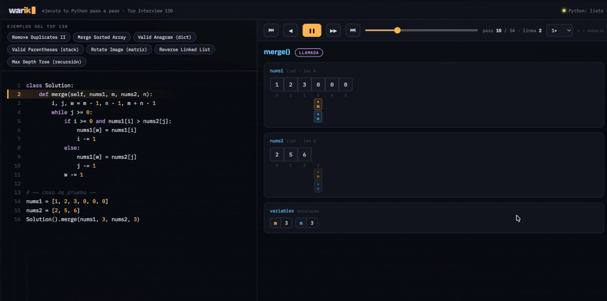

<div align="center">

# Warik

### Ejecuta tu Python paso a paso y velo por dentro 🐍

Warik corre tu código Python **línea por línea** y dibuja en vivo cómo cambian tus
estructuras de datos: arrays, punteros, diccionarios, árboles y más.
Pensado para practicar entrevistas (LeetCode · Top Interview 150).

[](LICENSE)
[](#-contribuir)
[](https://www.typescriptlang.org/)
[](https://github.com/The-Tito/warik/stargazers)



**[▶ Probar Warik en vivo](https://warikapp.pages.dev/)**

</div>

---

## ¿Qué es Warik?

Una herramienta web que **ejecuta código Python y lo visualiza paso a paso**. Pegas tu
solución de LeetCode, defines un caso de prueba, y avanzas por la ejecución viendo cómo
cambian tus variables y estructuras en cada línea.

Corre **100 % en tu navegador** gracias a [Pyodide](https://pyodide.org) (Python compilado a
WebAssembly): **sin servidor, sin instalación, sin enviar tu código a ningún lado**. La primera
ejecución descarga Python (unos segundos); después todo es local.

## 🔍 Qué visualiza

Arrays · punteros e índices · diccionarios · sets · matrices · stacks · listas enlazadas ·
árboles binarios — todos animándose y resaltando lo que cambió en cada paso.

## 🚀 Cómo se usa

1. **Pega tu solución** de LeetCode (o elige uno de los ejemplos precargados).
2. **Define el caso de prueba**: crea el input y llama a `Solution()`.
3. **Pulsa ▶ Ejecutar** y navega paso a paso (`←` `→` o la barra espaciadora).

## 💻 Correr en local

```bash
git clone git@github.com:The-Tito/warik.git
cd warik
npm install
npm run dev      # abre http://localhost:5173
```

> La primera ejecución en el navegador descarga Pyodide desde un CDN (necesita internet una vez).

Otros comandos: `npm run build` (build de producción a `dist/`), `npm test`, `npm run lint`.

## 🧠 Cómo funciona

Tres piezas:

1. **Tracer** (`src/tracer/tracer.py`) — instrumenta la ejecución con `sys.settrace` y serializa
   el estado de las variables a JSON en cada paso.
2. **Runner** (`src/runner/`) — carga Pyodide y ejecuta el código → una lista de *frames* tipados.
3. **Registry de visualizaciones** (`src/viz/`) — cada tipo de estructura tiene un *renderer* puro
   que se auto-registra; un orquestador despacha cada variable a su renderer.

Arquitectura en capas con dependencias en una sola dirección. El detalle está en
[`CLAUDE.md`](CLAUDE.md).

## 🤝 Contribuir

**La contribución estrella es agregar un nuevo tipo de visualización**, y está diseñada para ser
un cambio **local y guiado** gracias al registry:

1. Haz que el tracer emita un nuevo variante `{ t: 'mitipo', ... }` y añádelo a la unión `SerVal`
   en `src/core/frame.ts`.
2. Crea `src/viz/mitipo.ts` con una función pura `render` y regístrala con `registerViz(...)`.
3. Impórtalo en `src/viz/index.ts` (una línea).

Sin tocar nada más. Guía completa en `CONTRIBUTING.md` *(próximamente)*; mientras tanto,
[`CLAUDE.md`](CLAUDE.md) tiene la arquitectura y el flujo de trabajo.

Seguimos **Gitflow**: las features nacen de `develop` (ver [`CLAUDE.md`](CLAUDE.md#flujo-de-trabajo-git--gitflow)).
Si no sabes por dónde empezar, busca las issues etiquetadas **`good first issue`**.

### 🗺️ Roadmap

Nuevas visualizaciones buscando quien las construya:

- [ ] Grafos
- [ ] Heaps / colas de prioridad
- [ ] Programación dinámica (tablas)
- [ ] Tries
- [ ] Compartir una ejecución vía URL
- [ ] Persistencia local de tu código (`localStorage`)

### 💬 Feedback

¿Ideas, bugs o dudas? Abre un **[Issue](https://github.com/The-Tito/warik/issues)** o pasa por
**[Discussions](https://github.com/The-Tito/warik/discussions)**.

## 🛠️ Stack

[Vite](https://vitejs.dev) · [TypeScript](https://www.typescriptlang.org/) (estricto) ·
JavaScript vanilla (sin framework de UI) · [Pyodide](https://pyodide.org) · SVG/DOM.

## 📄 Licencia

[MIT](LICENSE) © The-Tito

## 🙏 Créditos

Construido sobre [Pyodide](https://pyodide.org), que hace posible correr Python en el navegador.
